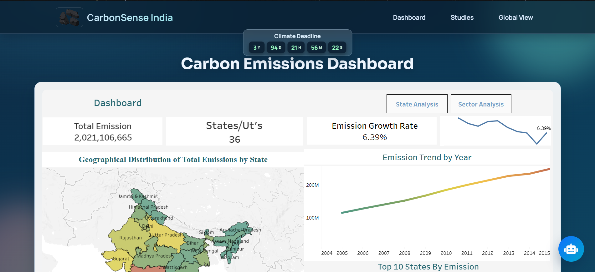
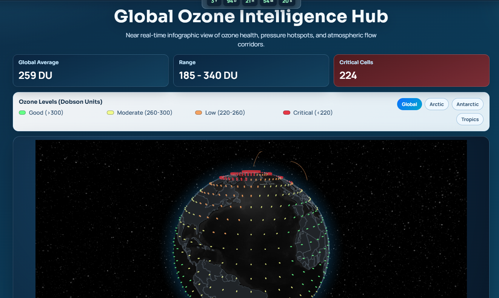
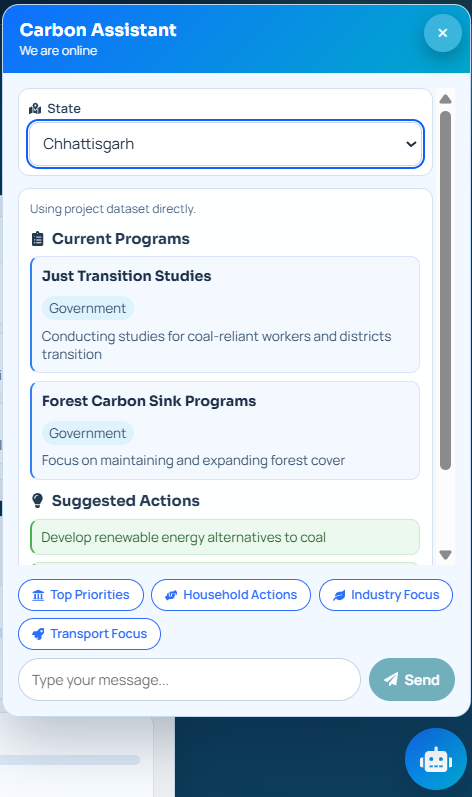
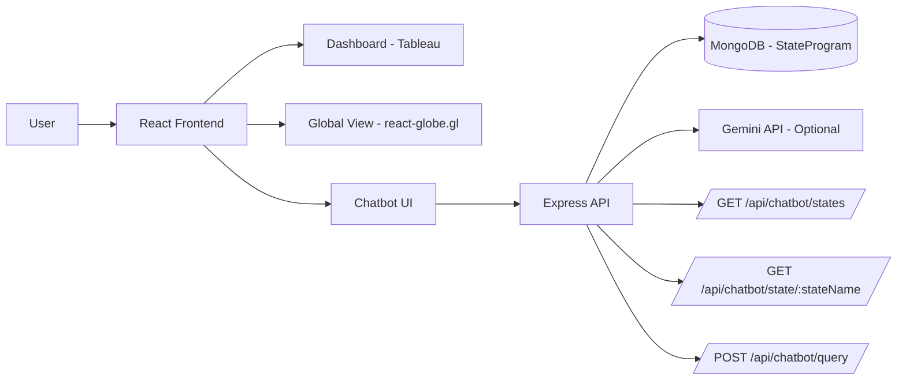
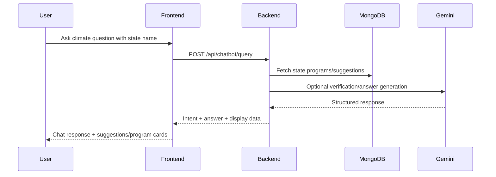

# CarbonSense India

[](./)
[](./frontend)
[](./backend)
[](./backend)

CarbonSense India is a climate intelligence web platform focused on India state-level emissions awareness.
It combines interactive dashboards, a global ozone visualization, and an AI-assisted chatbot that provides
state-specific climate actions, schemes, and reduction ideas.

---

## Table of Contents

- [Key Features](#key-features)
- [Screenshots](#screenshots)
- [Project Infographic](#project-infographic)
- [Architecture](#architecture)
- [Tech Stack](#tech-stack)
- [Folder Structure](#folder-structure)
- [Getting Started](#getting-started)
- [Environment Variables](#environment-variables)
- [API Reference](#api-reference)
- [Scripts](#scripts)
- [Development Notes](#development-notes)
- [Troubleshooting](#troubleshooting)
- [Roadmap](#roadmap)

---

## Key Features

- Interactive **state-wise emissions dashboard** (Tableau-embedded).
- **Global ozone intelligence view** with 3D globe visualization.
- AI + rule-based **chatbot** for:
  - state-specific schemes/programs
  - household, transport, industry, and agriculture actions
  - top climate priorities and suggested ideas
- Multi-page UI with smooth loading experiences and responsive design.

---

## Screenshots

### Dashboard View

*Interactive Tableau dashboard showing state-wise carbon emissions and climate data.*

### Global View

*3D Globe visualization with ozone distribution and key observation points worldwide.*

### Chatbot Interface

*AI-powered chatbot for state-specific climate actions and emission reduction strategies.*

### Mobile Responsive Design

*Seamless experience across desktop and mobile devices.*

---

## Project Infographic



### User Journey Snapshot



---

## Architecture

### Frontend
- React SPA (`frontend/`)
- Route-based pages:
  - Dashboard
  - Studies
  - Global View
- Chatbot floating widget and climate clock components

### Backend
- Express API (`backend/`)
- MongoDB model-backed state data
- Conversational query routing with intent detection and fallback logic
- Optional Gemini enrichment if API key is configured

---

## Tech Stack

| Layer | Tools |
|---|---|
| Frontend | React, React Router, Axios, React Icons, react-globe.gl, three |
| Backend | Node.js, Express, CORS, Body-Parser, Dotenv |
| Database | MongoDB + Mongoose |
| AI | Gemini API (optional, environment-driven) |
| Tooling | npm, concurrently, nodemon |

---

## Folder Structure

```text
CarbonSense/
  backend/
    config/
    data/
    models/
    routes/
    package.json
    server.js
  frontend/
    public/
    src/
      components/
      App.js
      App.css
    package.json
  package.json
  .gitignore
```

---

## Getting Started

### 1) Clone

```bash
git clone <your-repo-url>
cd CarbonSense
```

### 2) Install dependencies

```bash
npm install
npm install --prefix backend
npm install --prefix frontend
```

### 3) Configure environment

Create `backend/.env`:

```dotenv
PORT=5000
NODE_ENV=development
FRONTEND_URL=http://localhost:3000
MONGODB_URI=mongodb://127.0.0.1:27017/carbonsense
GEMINI_API_KEY=your_gemini_api_key
GEMINI_MODEL=gemini-2.5-flash
```

### 4) Run in development

```bash
npm run dev
```

- Frontend: `http://localhost:3000`
- Backend: `http://localhost:5000`

---

## Environment Variables

| Variable | Required | Description |
|---|---:|---|
| `PORT` | No | Backend port (default: `5000`) |
| `NODE_ENV` | No | Runtime mode (`development`/`production`) |
| `FRONTEND_URL` | Yes | Allowed frontend URL for CORS |
| `MONGODB_URI` | Yes | MongoDB connection string |
| `GEMINI_API_KEY` | Optional | Enables Gemini-assisted responses |
| `GEMINI_MODEL` | Optional | Gemini model id (default fallback is used) |

---

## API Reference

Base URL: `http://localhost:5000`

### Health

- `GET /api/health`
- Returns service status, environment, and timestamp.

### Chatbot

- `GET /api/chatbot/states`
  - Returns available state names.

- `GET /api/chatbot/state/:stateName`
  - Returns state programs + suggestions and merged display variants.

- `POST /api/chatbot/query`
  - Body:
    ```json
    {
      "message": "What are top priorities in Punjab?"
    }
    ```
  - Returns detected intent, answer, state context, programs/suggestions, and metadata.

---

## Scripts

### Root

```bash
npm run dev            # backend + frontend together
npm run dev:backend    # backend only
npm run dev:frontend   # frontend only (polling mode)
```

### Backend

```bash
npm run start --prefix backend
npm run dev --prefix backend
```

### Frontend

```bash
npm run start --prefix frontend
npm run build --prefix frontend
npm run test --prefix frontend
```

---

## Development Notes

<details>
<summary><strong>Intent Detection (Chatbot)</strong></summary>

The backend classifies messages into intents such as:
- `households`
- `transport`
- `industry`
- `agriculture`
- `priorities`
- `schemes`
- `ideas`
- `unsupported`

Then it builds a state-aware answer from project data, with AI enhancement when configured.
</details>

<details>
<summary><strong>Data Safety and Secrets</strong></summary>

- `.env` files are ignored by git via `.gitignore`.
- Never commit API keys or DB credentials.
- Rotate keys immediately if accidentally exposed.
</details>

---

## Troubleshooting

- **Frontend changes not detected in synced folders (OneDrive):**
  use `start:watch` script (already configured in frontend).

- **`403` when pushing to GitHub:**
  ensure you are pushing to your own fork and have correct remote auth.

- **Chatbot fallback responses only:**
  verify `GEMINI_API_KEY` and internet access from backend runtime.

---

## Roadmap

- Add test coverage for chatbot intent and route behavior.
- Add CI checks for lint/build/test.
- Improve observability and structured logging.
- Add analytics panel for query trends.

---

## Credits

Built for climate data accessibility and public climate awareness in India.
